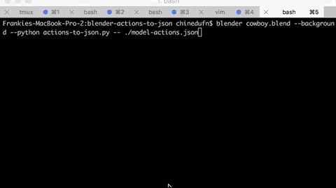

blender-actions-to-json [](http://badge.fury.io/js/blender-actions-to-json) [](https://travis-ci.org/chinedufn/blender-actions-to-json)
===============

> Given a Blender `.blend` file, write the joint data for all actions to a JSON file



## Initial Background / Motivation

#### Before

I export my Blender models to COLLADA using the native Blender COLLADA exporter before parsing these COLLADA files for my model's data.

Unfortunately this only includes the raw keyframes and no metadata about which keyframes belong to which action,
so I end up needing to manually keep track of which keyframe each action starts on.

#### After

The purpose of this module is to remove that work for me. Now if I want to get the keyframes and joints for the `attack` animation, I can just
reference the JSON action file that this module generates under the key `attack`.
If the number of keyframes for the `attack` action changes, they'll still all be under the `attack` action key in the JSON data so
I will still have access to them without needing to manually specify the new range of keyframes. Just iterate over the `attack` key

This is part of an effort to automate more of my asset pipeline.

## To Install

```sh
npm install -g blender-actions-to-json
# Save to Blender User Preferences
actions-to-json --install
```

## Usage

```
# Run via CLI
blender /path/to/my-model.blend --background --python `actions2json` -- /path/to/output.json
```

```
# Run via bpy.ops
bpy.ops.import_export.actions2json(filepath='/path/to/output.json')
```

The outputted file will look something like this:

```json
{
  "actions": {
    "some-action": {
      "0.041667": [
        [1.0, 0.0, 0.0, 0.0, 0.0, 0.0, -1.0, 0.0, 0.0, 1.0, 0.0, 0.0, 0.0, 0.0, 0.0, 1.0],
        [1.0, 0.0, 0.0, 0.0, 0.0, 0.0, -1.0, 0.0, 0.0, 1.0, 0.0, 0.0, 0.0, 0.0, 0.0, 1.0],
      ],
      "0.833333": [
        [1.0, 0.0, 0.0, 0.0, 0.0, 0.0, -1.0, 0.0, 0.0, 1.0, 0.0, 0.0, 0.0, 0.0, 0.0, 1.0],
        [1.0, 0.0, 0.0, 0.0, 0.0, 0.0, -1.0, 0.0, 0.0, 1.0, 0.0, 0.0, 0.0, 0.0, 0.0, 1.0]
      ]
    },
    "another-action": {
      "0": [
        [1.0, 0.0, 0.0, 0.0, 0.0, 0.0, -1.0, 0.0, 0.0, 1.0, 0.0, 0.0, 0.0, 0.0, 0.0, 1.0],
        [1.0, 0.0, 0.0, 0.0, 0.0, 0.0, -1.0, 0.0, 0.0, 1.0, 0.0, 0.0, 0.0, 0.0, 0.0, 1.0],
      ]
    }
  },
  "inverseBindPoses": {
    [1.0, 0.0, 0.0, 0.0, 0.0, 0.0, -1.0, 0.0, 0.0, 1.0, 0.0, 0.0, 0.0, 0.0, 0.0, 1.0],
    [1.0, 0.0, 0.0, 0.0, 0.0, 0.0, -1.0, 0.0, 0.0, 1.0, 0.0, 0.0, 0.0, 0.0, 0.0, 1.0]
  },
  "jointNameIndices": {
    "Torso": 0,
    "Chest": 1
  }
}
```

The file has all of your actions. Each action has all of the keyframe times for that action.
Each keyframe time has the pose matrices for each joint in your armature.

The ordering of the joints is the same as `bpy.context.selected_pose_bones`. Whatever model exporter
you use probably uses this same order.

For example, COLLADA export files will have your joints in the same order that these actions are, so you
can just match them up.

If any of this is confusing please open an issue!

## CLI Usage

```sh
actions2json --help

Usage

  $ actions2json
    # Returns the filename of the Blender addon. Useful for running the addon via CLI
    # i.e.
    #   blender my-model.blend --python \`actions2json\` -- /var/tmp/output-file.json

  $ actions2json --help
    # Prints some help text on how to use this command

  $ actions2json --install
    # Installs and enables the addon and then saves it to your Blender user preferences
    # Note that you must have Blender in your $PATH in order for this command to work

Options

  -h, --help            -> Get help text about using the blender-actions-to-json CLI

  -i, --install         -> Install the addon and save it in your Blender

```

## Note

`blender-actions-to-json` currently only exports actions for one armature.

**This script currenly requires that your `bpy.context.active_object` is your armature.**

`blender-actions-to-json` will use the first armature that it finds if the `bpy.context.active_object` is not an armature,
so if your file only has one armature you're good to go.

Otherwise you will need either need to select your desired armature before running this script.

You can do this by either:

1. Running an armature selection script before this script
2. OR manually right click it while in object mode before running this script.

If you're looking to use this script as part of a fully automated pipeline, `#2` is not an option and you will need to do #1.

You can chain blender scripts, so you can run `blender my-model.blend --background --python my-script-that-selects-armature --python blender-actions-to-json.py -- ./outputfile.json`

Again, all of this only applies if your Blender file has more than one armature. When I eventually work with files with multiple armatures I'll have a better
idea of how to address this.

If any of this is confusing please open an issue and I'll try to give a better explanation based on your question(s)!

## To test

In order to run the tests you'll need to have `blender` in your $PATH so that we can spawn a headless blender process from Node.js.

If Blender isn't already in your $PATH, on mac you can try `export PATH="$PATH:/Applications/blender.app/Contents/MacOS"` in your terminal

```sh
git clone https://github.com/chinedufn/blender-actions-to-json
cd blender-actions-to-json
npm install
npm run test
```

## TODO:

- Maybe support a `-p, --precision` flag to specify the number of decimal places that pose matrices are rounded to

## See Also

- [blender-iks-to-fks](https://github.com/chinedufn/blender-iks-to-fks)

## License

MIT
